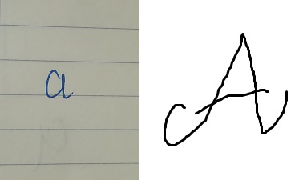
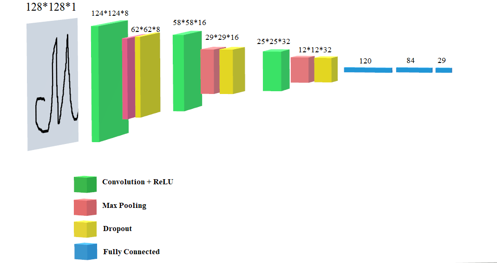
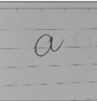
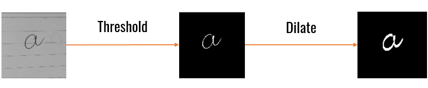
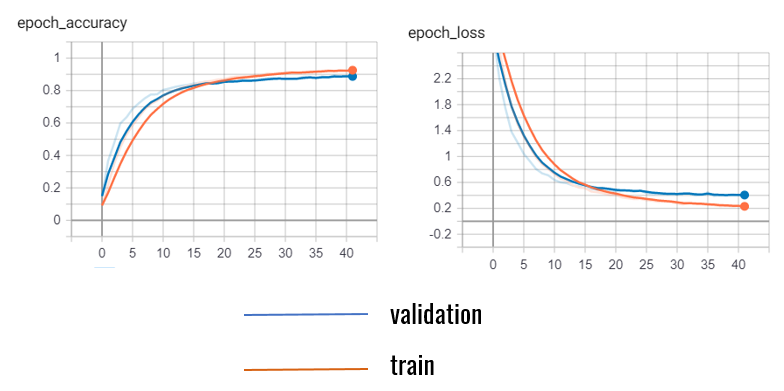
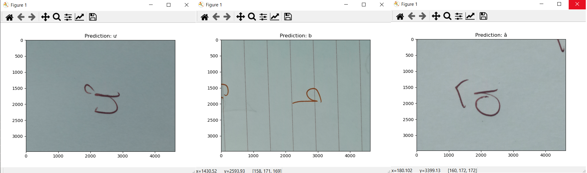
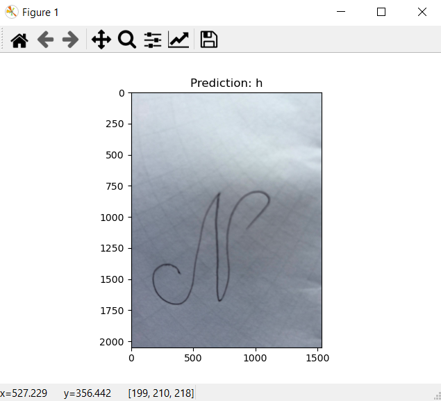

# Vietnamese Hand Written character 
## Description
School project for Artificial Intelligence and Application course.  
This is a 29 classes classification problem correspond to 29 characters in Vietnamese alphabet.  
## Dataset
The dataset was created by my friends, written by hand and in MS Paint,
then capture with a phone so some of the images have really high resolution.  
  
I will upload the dataset elsewhere soon  
## Model  
  
Above is the our CNN architecture, stacking Conv
and MaxPool layer with ReLU activation. Dropout is added to prevent
the model from overfitting with our small dataset. The last Fully-Connected
layer is 29 neurons because there are 29 characters in Vietnamese alphabet.
## Preprocess Data
We first grayscale and resize our images to 128*128 pixels.  
  
After feeding these images to the model, we didn't get the result we expected.
We pre-process the data furthermore by thresholding and dilate.
  
And the result was better.  
Also we use `data augmentation` to generate more images in training folder so the 
model doesn't get overfit.  
## Evaluation
Training with `Early Stopping`, the model stops after aprx 40 epochs.
  
Here are some of the predictions  
  
But there's still overfitting issue when predicting images not 
similar to ones in the dataset, or images that go through our pre-process
steps and don't look so good after that  
  
This is the final image after pre-processing, goes into the model
for prediction  
  
## Future work 
- Use a more diverse dataset
- Better pre-process 
- Use better model architecture